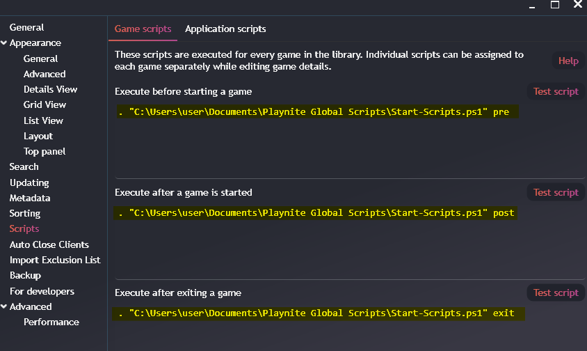

# Playnite framework for easier scripts control

I hate the current playnite way of editing scripts so I made this shit.

## Usage

1. Download source code, unzip it, and place it wherever you want.
2. Check [requirements](#requirements).
3. Go to playnite `Settings` (`F4`) -> `Scripts`
4. Put `. "${Star-Scripts.ps1 file path}" (pre/post/exit)` on every script location as .

5. Go to [setting custom scripts](#setting-custom-scripts)

## Requirements

The only requirements are the apps used within the scripts, such as magpie, openTabletDriver, and nircmd.
If you do not want to use the Set-AppVolume, you can avoid installing nircmd and you can delete that file.

## Setting Custom Scripts

Custom scripts can be run before and after starting, and also after exiting a game.
There are two ways of handling them:

1. A more general script (see [UbiConnect.ps1](exit/UbiConnect.ps1)).
2. Or game specific scripts (see [osu.ps1](gameSpecific/osu.ps1)).

General scripts can be run for every game, they go to the `pre`, `post` and `exit` directories.
On the other hand, game specific scripts only run if the name matches the game name.

> [!WARNING]  
> Errors thrown inside this scripts will halt the remaining scripts execution.
